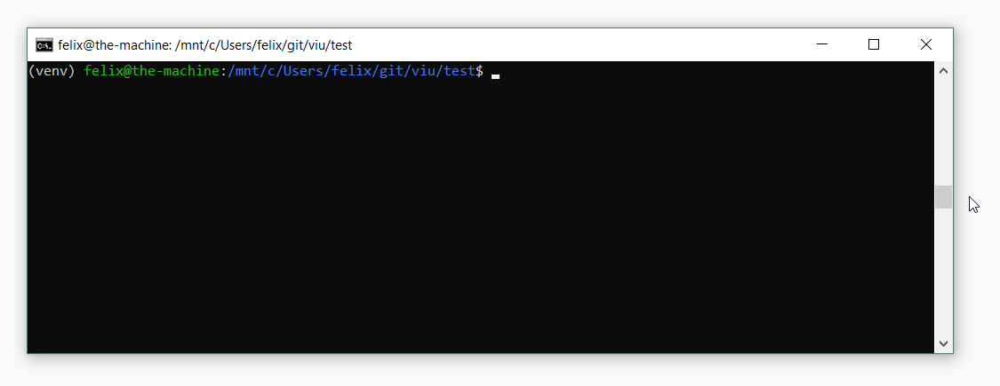

# *viu*

A small *less*-like Python code viewer with responsive formatting and styling



## Installation

Install via pip:

```
pip install viu
```

Usage:

```
viu <your_file.py>
```

## About

*viu* uses the following packages:

- [Black](https://github.com/ambv/black) (for formatting code)
- [pygments](http://pygments.org/) (for color support)

## Feedback

I'd love to hear your feedback. Feel free to open an issue, send an [e-mail](mailto:felix.kohlgrueber@gmail.com) or reach out on twitter [@fkohlgrueber](https://twitter.com/fkohlgrueber).
